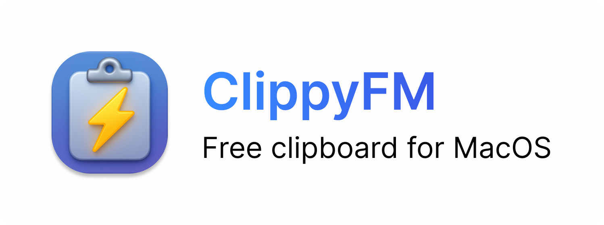

# ✨ ClippyFM — Your macOS Clipboard, Reimagined

  

> Smart. Private. Beautiful. The clipboard app that makes copy & paste feel premium.

ClippyFM is a lightweight macOS utility that keeps your clipboard tidy, searchable, and instantly accessible — without the clutter. Designed for creators, power users, and anyone who copies more than they paste. ClippyFM sits quietly in your menu bar and gives you a beautiful visual history of what you've copied, so you can focus on work that actually matters.

## ✨ Features

- Beautiful clipboard grid with rich previews (text, images, links)
- Fast keyboard and menu-bar access — get exactly what you need in one keystroke
- Pin favorites and organize snippets into collections
- Smart search that finds text, links, and image previews instantly
- One-click pasteboard clearing and secure deletion
- Tiny memory footprint — built for macOS and optimized for battery life

---

## 📦 Installation

1. Download the DMG from the `DMG/ClippyFM.dmg` file in this repository (or from Releases when available).
2. Open the DMG and drag ClippyFM into your Applications folder.
3. Launch ClippyFM, allow the necessary accessibility & pasteboard permissions when prompted.
4. Use the menu bar icon or the configurable hotkey to open your clipboard grid.

Note: A free trial is planned for the App Store / direct distribution. This repository contains a placeholder DMG for packaging and release notes.

---

## 🔒 Privacy

Privacy is core to the ClippyFM experience. We treat your clipboard data like it never leaves your device:

- All clipboard history stays locally on your Mac.
- We do not collect or transmit clipboard contents to any servers.
- Optional cloud sync (coming later) will be end-to-end encrypted and opt-in only.

If you have specific privacy questions, email aakashrohilla.work@gmail.com.

---

## 🧠 Made by Aakash

ClippyFM was lovingly crafted by Aakash Rohilla.

Email: aakashrohilla.work@gmail.com

LinkedIn: https://www.linkedin.com/in/aakashrohilla

If you'd like to collaborate, contribute, or request features, open an issue or reach out via email or LinkedIn.

---

## 🚀 Why people will love ClippyFM

- Minimal, elegant design that feels native to macOS
- Saves time for people who copy/paste a lot
- Thoughtful privacy controls so you can work with confidence

Thank you for checking out ClippyFM — small tool, big productivity boost.
